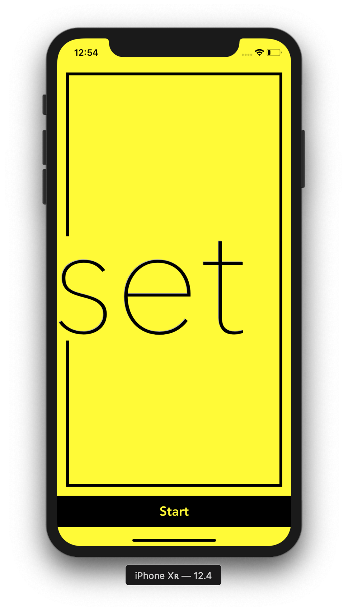
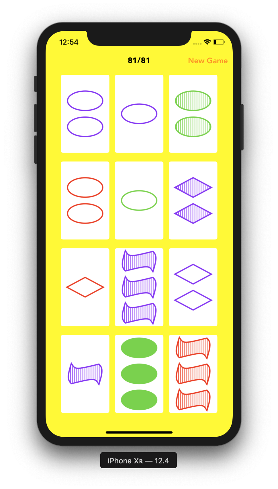

# Set Graphics

## Getting Started

Clone the project to where you want to have it on your local machine and run it with Xcode

## Rules

[Set](https://en.wikipedia.org/wiki/Set_(card_game))

## Quick Look

### Opening

### Game On

## Versions

* **Version 2.0:** 

## Author

* [**Nhan Cao**](https://www.linkedin.com/in/nhan-cao/)
